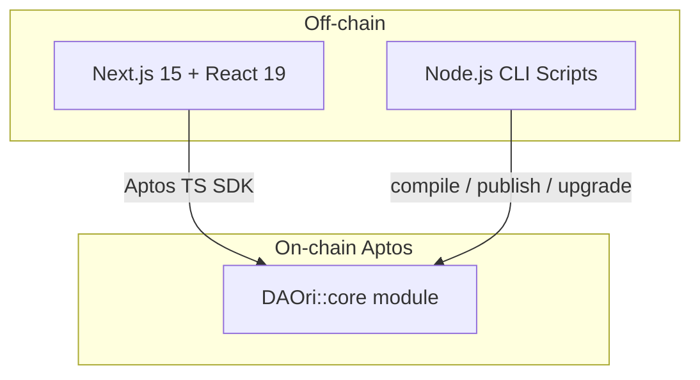
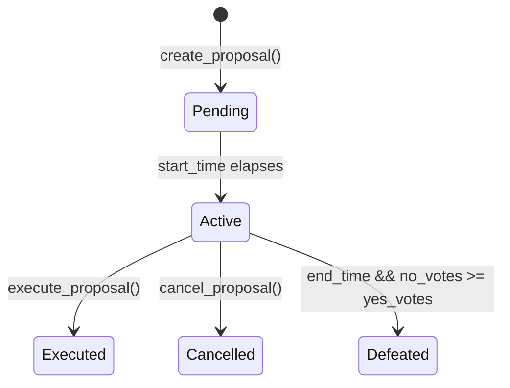
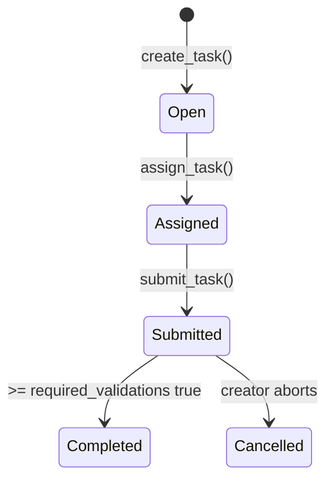

# ArcheDAO

**Deployed Contract (Devnet): [`0x47b3efcc81c7563f7ef0598a17957737db9b2f9bd0e83c6cc9fa0efaf24f8120`](https://explorer.aptoslabs.com/object/0x47b3efcc81c7563f7ef0598a17957737db9b2f9bd0e83c6cc9fa0efaf24f8120?network=devnet)**

> A **next-gen Decentralised Autonomous Organisation framework** built for the **Build On Aptos Hackathon – Kolkata Edition**. ArcheDAO fuses an enterprise-grade Move on–chain governance engine with a highly-interactive Next.js (React 19) front-end, delivering an end-to-end toolkit for spinning-up, operating and analysing DAOs on the Aptos network.

---

## Table of Contents
1. [Motivation](#motivation)
2. [Architecture Overview](#architecture-overview)
3. [Smart-Contract (Move) Layer](#smart-contract-move-layer)
4. [Web Client](#web-client)
5. [Local Development & Deployment](#local-development--deployment)
6. [Project Layout](#project-layout)
7. [Event Flows & State Machines](#event-flows--state-machines)
8. [Analytics & Extensibility](#analytics--extensibility)
9. [Security Considerations](#security-considerations)
10. [Contributing](#contributing)
11. [License](#license)

---

## Motivation
Traditional DAOs either sacrifice **expressiveness** (feature-poor snapshot clones) *or* battle with **governance dead-weight** (high quorum, low participation). ArcheDAO tackles both by:

* **Weighted, hybrid voting** – combines *reserved* voting power for critical roles (owner/governors) with *stake-based* proportional voting for members.
* **Unified governance objects** – proposals, tasks, AIPs (Arche Improvement Proposals) all live inside a single Move module making cross-object analytics trivial.
* **Off-the-shelf growth levers** – premium subscriptions, delegate registries, AI delegates – everything is an entry function away.

The stack is laser-focused on **developer experience**: zero ceremony TypeScript SDK usage on the client, `npm` scripts for one-command compilation/publishing on the backend.

---

## Architecture Overview


* **`DAOri::core`** (Move) – single-module, ~3.5 KLoC governance engine that stores *all* state on-chain: DAOs, proposals, tasks, delegates, AIPs, staking, analytics, etc.
* **Client** (Next.js / TypeScript / Tailwind) – renders dashboards, proposal builders, task boards, analytics. Uses `@aptos-labs/ts-sdk` & `wallet-adapter-react` for seamless wallet interactions.
* **Scripts** – thin Node wrappers (`contracts/scripts/move/*.js`) around the Aptos CLI for deterministic compilation, publishing and upgrading from CI/CD.

---

## Smart-Contract (Move) Layer
File: `contracts/contract/sources/archedao.move`

### Constants & Economic Parameters
| Constant | Description | Default |
|----------|-------------|---------|
| `PLATFORM_FEE_RATE` | Basis-points cut on bounties (2.5 %) | `250` |
| `PREMIUM_SUBSCRIPTION_COST` | Yearly premium fee | `1 APT` |
| `DAO_CREATION_FEE` | Cost to instantiate a DAO | `2 APT` |
| `MINIMUM_STAKE_AMOUNT` | Threshold to unlock voting rights | `0.01 APT` |

*(see code for the full list)*

### Core Data Structures
* `UserProfile` – single source of truth for identity, reputation, contribution scores and delegation info.
* `DAO` – embeds governance params (`voting_period`, `execution_delay`, `minimum_proposal_threshold`) and **dynamic Tables** for staking & active proposals.
* `Proposal`, `Task`, `AIP` – discrete governance artefacts with rich metadata and life-cycle states.
* `Delegate` & `AIDelegate` – human and ML-powered vote proxies, each tracking performance metrics on-chain.

### Critical Entry Functions
| Function | Purpose |
|----------|---------|
| `initialize` | Bootstrap platform config & registries. Must be called exactly once by the admin. |
| `create_dao` | Spawn a DAO; emits `DAOCreated`, handles fee transfer, sets up settings. |
| `create_proposal` / `vote` / `execute_proposal` | Full proposal life-cycle with **time-locked execution** & on-chain vote accounting. |
| `create_task` / `assign_task` / `validate_task` / `distribute_bounty` | GitHub-like issue workflow backed by on-chain validation quorum. |
| `stake_for_voting_power` / `unstake_voting_power` | Weighted staking with continuous vote power recalculation. |
| `delegate_voting_power` & `delegate_vote` | Non-custodial power delegation for governance load-balancing. |

### Views & Analytics
Over **40 public `#[view]` functions** – from simple getters (`get_platform_stats`) to the monster **`get_complete_user_dao_ecosystem`** returning an *entire* user's DAO universe in one call (ideal for GraphQL-like indexing).

### Events
All state-mutating functions emit precise events (e.g. `StakeDeposited`, `GovernorPromoted`) enabling real-time indexers and sub-graphs.

---

## Web Client
* **Framework**: Next.js 15 (Turbopack dev) + React 19 + TypeScript.
* **Styling**: Tailwind CSS 3 + Radix UI primitives + custom shadcn components.
* **State / Data**: TanStack Query 5 for cache; global Wallet provider via `@aptos-labs/wallet-adapter-react`.
* **3D flair**: `three.js`, `@react-three/fiber`, `maath` for interactive hero visuals.
* **Charting**: Recharts + Tremor for DAO analytics dashboards.

Important directories:
```
client/
 ├─ app/            # Next.js App-router pages & routes (server+client components)
 │   ├─ api/        # Edge routes surfacing on-chain analytics & chat (OpenAI)
 │   └─ dao/        # Dashboard, proposals, tasks UX flows
 ├─ components/     # Reusable UI & util components (shadcn-variant)
 ├─ hooks/          # Custom React hooks (useTaskManager, useProposalFilter, …)
 └─ lib/ utils/     # Type helpers & misc shared utilities
```

---

## Local Development & Deployment
### Prerequisites
* **Node.js ≥ 20** (LTS) – for client & scripts
* **Aptos CLI** (`cargo install --git https://github.com/aptos-labs/aptos-core/ aptos --tag devnet`) – Move compiler
* **Git / bash / zsh** (Unix-like environment)

### 1 ️⃣ Clone & bootstrap
```bash
$ git clone https://github.com/<your-fork>/ArcheDAO.git && cd ArcheDAO
$ npm install               # install root git hooks (optional)
```

### 2 ️⃣ Smart-contract setup
```bash
$ cd contracts
$ cp env.template .env      # fill MODULE_PUBLISHER_* + APP_NETWORK (devnet / testnet / mainnet)
$ npm install               # installs ts-sdk & dotenv

# Compile Move package
$ npm run move:compile

# Publish to Aptos
$ npm run move:publish      # writes MODULE_ADDRESS to .env automatically
```

### 3 ️⃣ Web client
```bash
$ cd ../client
$ npm install               # or bun i
$ npm run dev               # http://localhost:3000
```

### 4 ️⃣ Running tests
```bash
# Move unit tests (inside Move package)
$ cd contracts && npm run move:test
```

---

## Project Layout
```text
ArcheDAO/
├─ client/         # Next.js front-end
│  └─ …
├─ contracts/      # Move package & JS helper scripts
│  └─ contract/
│     ├─ Move.toml
│     └─ sources/archedao.move
├─ GOVERNOR_DASHBOARD_GUIDE.md  # UI usage guide for governors
└─ README.md      # you are here
```

---

## Event Flows & State Machines
### Proposal Life-cycle


### Task Life-cycle


---

## Analytics & Extensibility
* **`get_dao_analytics`** – one-shot tuple for dashboards.
* **`get_delegate_analytics`** – fast delegate leaderboard.
* **`batch_delegate_votes`** – gas-optimised multi-vote entry point.
* **Central registries** (`DAORegistry`, `ProposalRegistry`, `TaskRegistry`, `AIPRegistry`) make off-chain indexers trivial – enumerate IDs and fetch in parallel.

Need custom logic? Fork `archedao.move` and:
1. Add your struct / event.
2. Insert into registries.
3. Re-compile & publish again (module upgrade supported via script).

---

## Security Considerations
* **Access Control** – role checks (`E_NOT_AUTHORIZED`) on every sensitive entry function.
* **Re-entrancy-safe** – Aptos Move is single-threaded per transaction; internal invariants protected by `assert!`.
* **Economic Guarantees** – minimum stake enforced; unstake restricted when active proposals exist.
* **Upgrade Path** – `move:upgrade` script leverages *compat-checker* to avoid breaking changes.

---

## Contributing
We would love contributions! To get started:
1. Fork → feature branch → PR.
2. Ensure `npm run lint` & `npm run build` pass in both `client/` and `contracts/`.
3. For Move changes run `npm run move:test`.
4. Sign the CLA in the PR body *(hackathon requirement)*.

Issues / ideas / paper-cuts – create a GitHub issue and tag the maintainers.

---

## License
Apache 2.0 for contracts & MIT for the web client. See individual `LICENSE` files where applicable.

---

<h3 align="center">Built with ❤️ in Kolkata for the Build On Aptos Hackathon 2024</h3> 
